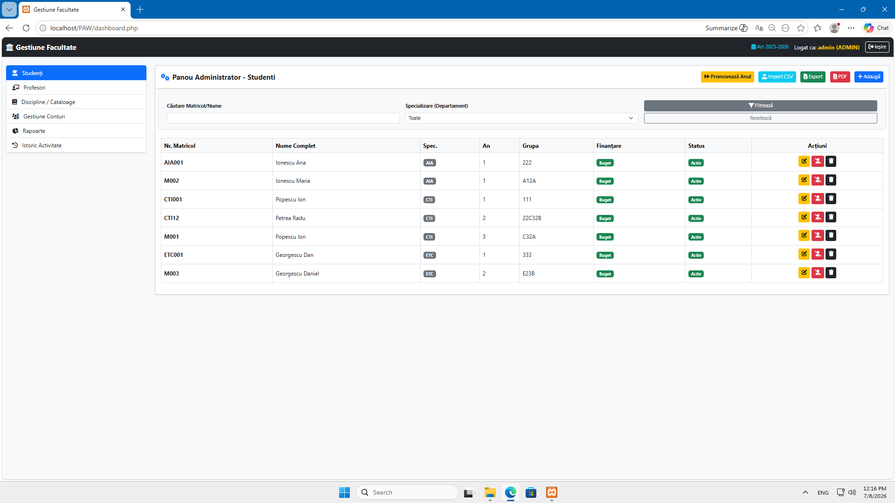

# 🎓 Gestiunea studenților și a notelor la facultate

Acest repository conține proiectul realizat pentru disciplina Proiectarea Aplicațiilor Web (PAW). Este o aplicație web dezvoltată în PHP, HTML, CSS, JavaScript și folosește MySQL (via PDO) pentru gestionarea bazelor de date.

Scopul principal al proiectului este de a digitaliza procesul administrativ și educațional dintr-o facultate, permițând trecerea de la cataloagele fizice pe hârtie și cozile de la secretariat, la un sistem centralizat, rapid și sigur.

---

## 📌 Analiza Problemei

Activitatea de bază a unei instituții de învățământ superior implică o organizare administrativă complexă. În formatul clasic:
* Studenții sunt nevoiți să aștepte pe holuri pentru a-și vedea notele sau pentru a-și verifica restanțele.
* Profesorii transportă cataloage fizice în care completează și semnează manual notele.
* Secretariatul este îngropat în registre, calculând manual mediile ponderate pentru a împărți studenții pe locuri bugetate/cu taxă.

Aplicația rezolvă aceste probleme oferind o platformă web unde profesorii trec notele digital, studenții își vizualizează situația de acasă, iar personalul administrativ generează rapoarte automat.

---

## 👥 Funcționalități (Roluri)

Aplicația folosește un sistem de autentificare cu sesiuni și diferențiază accesul pe 3 niveluri:

### 🛠️ 1. Administrator (Secretariat)
* **Gestiune (CRUD):** Adaugă, editează și șterge studenți, profesori și discipline.
* **Filtrare:** Caută studenți după nume/matricol sau filtrează după specializare/an.
* **Rapoarte (Chart.js):** Generează grafice vizuale privind distribuția notelor acordate într-o perioadă selectată.
* **Export:** Salvează listele și rapoartele în format PDF sau Excel (XLSX).
* **Audit Log (Istoric):** Vizualizează exact ce persoană a modificat o informație, acțiunea (INSERT/UPDATE/DELETE) și data/ora.

### 👨‍🏫 2. Profesor
* Accesează "Materiile Mele" (doar disciplinele la care este titular).
* Vizualizează grupele sub forma unui Catalog electronic.
* Adaugă, corectează sau șterge note pentru propriii studenți.
* Filtrează catalogul pentru a găsi rapid Restanțierii.
* Poate salva catalogul disciplinei în format PDF.

### 🎓 3. Student
* Accesează "Notele Mele" pentru a vizualiza situația școlară curentă.
* Poate filtra pentru a afișa exclusiv Restanțele (note sub 5).
* Descarcă situația școlară în format PDF.
* Vizualizează datele administrative (matricol, finanțare, grupă) în "Profilul Meu".

---

## 🗄️ Structura Bazei de Date (MySQL)

Proiectul utilizează PDO (PHP Data Objects) pentru a preveni atacurile SQL Injection, iar parolele sunt securizate prin hashing (`PASSWORD_BCRYPT`).

Baza de date relațională (`facultate_db`) conține următoarele tabele:
* `utilizatori` (PK: id_utilizator)
* `studenti` (PK: id_student) - FK către utilizatori
* `profesori` (PK: id_profesor) - FK către utilizatori
* `discipline` (PK: id_disciplina)
* `profesori_discipline` - Tabel de joncțiune (N:M)
* `note` - Tabel de legătură între student, disciplină și profesor
* `istoric` - Tabel pentru salvarea log-urilor de audit

---

## 💻 Tehnologii utilizate
* **Backend:** PHP (PDO)
* **Bază de date:** MySQL / MariaDB
* **Frontend:** HTML5, CSS3, JavaScript
* **Librării UI:** Bootstrap 5, FontAwesome
* **Grafice:** Chart.js

---

## 🚀 Cum se instalează și rulează proiectul local

1. Descarcă și instalează un server local, precum **XAMPP**.
2. Clonează sau descarcă acest repository în folderul `htdocs` din instalarea XAMPP (ex: `C:\xampp\htdocs\PAW`).
3. Pornește modulele **Apache** și **MySQL** din panoul de control XAMPP.
4. Accesează `http://localhost/phpmyadmin` în browser.
5. Creează o bază de date nouă cu numele `facultate_db`.
6. Importă fișierul `facultate_db.sql` (inclus în acest repository) în baza de date nou creată.
7. Dacă ai setat o parolă pentru `root` în MySQL, actualizează fișierul `config.php`. Dacă folosești XAMPP standard, lasă setările implicite (user: root, parola: [goală]).
8. Accesează aplicația în browser la: `http://localhost/PAW/`

**Conturi de test incluse:**
* **Admin:** admin / 1234
* **Profesor:** popescu.ion / 1234
* **Student:** petrea.andrei / 1234

---

## 📸 Capturi de ecran

### 1. Interfață Administrator
**Panou Gestiune Studenți:** Permite vizualizarea, filtrarea, adăugarea, modificarea și ștergerea studenților, precum și exportul datelor (CSV/PDF).

**Gestiune Conturi și Parole:** Modul de administrare a accesului în platformă, cu opțiuni de resetare a parolelor la valoarea standard și ștergerea conturilor.
.png)

### 2. Interfață Profesor
**Catedra Mea:** Panoul de management unde profesorul își poate vizualiza disciplinele predate și accesa rapid cataloagele aferente.
.png)

**Catalog Electronic:** Interfața unde titularul notează studenții, aplică filtre și poate printa situația disciplinei.
.png)

### 3. Interfață Student
**Foaie Matricolă:** Dashboard-ul studentului care afișează situația curentă: media ponderată, creditele acumulate, restanțele active și un istoric detaliat al notelor.
.png)
